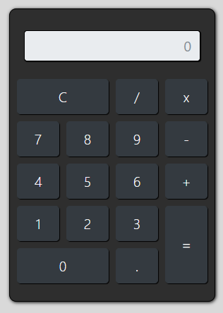

# Calculadora JavaScript
## Aplicativo de uma calculadora simples utilizando html, css, e javaScript
<h1 align="center">
 Calculadora-JS
</h1>

 <a href="#sobre-o-projeto">Sobre</a> •
 <a href="#funcionalidades">Funcionalidades</a> •
 <a href="#layout">Layout</a> • 
 <a href="#tecnologias">Tecnologias</a> • 

<h4 align="center"> 
	 Calculadora 🧮 Finalizado
</h4>

## 🧮 Sobre o projeto

🧮 A calculadora criada com javaScript foi um projeto desenvolvido durante o curso de Desenvolvimento Web ministrado pelo professor Jamilton Damasceno

Esse projeto foi desenvolvido para o estudo de implementação de conceitos básicos e introdutórios em javaScript, abordando temas como DOM na seleção de elementos, manipulação de valores
de inputs, manipulação de elementos de estilo, manipulação de classes de elementos...
---

## ⚙Funcionalidades

-Basicamente o projeto consiste em uma calculadora simples, capaz de realizar a operações básicas da matemática pois o fim é apenas didático e introdutório em javaScript:

  Página Index:
  
  Nesta página está localizada a calculadora feita através de html, css e bootstrap.
  
  <h3>Imagem da calculadora</h3>
  
  
  ---

## 🎨Layout

O layout foi fornecido pelo professor 
[Jamilton Damasceno](https://www.linkedin.com/in/jamiltondamasceno/).

### 🛠Tecnologias

As seguintes ferramentas foram usadas na construção do projeto:

- [HTML](https://www.w3schools.com/html/default.asp)
- [CSS](https://www.w3schools.com/css/)
- [JS](https://developer.mozilla.org/pt-BR/docs/Web/JavaScript)
- [Bootstrap](https://getbootstrap.com/)
- [VisualStudio](https://visualstudio.microsoft.com/pt-br/)
